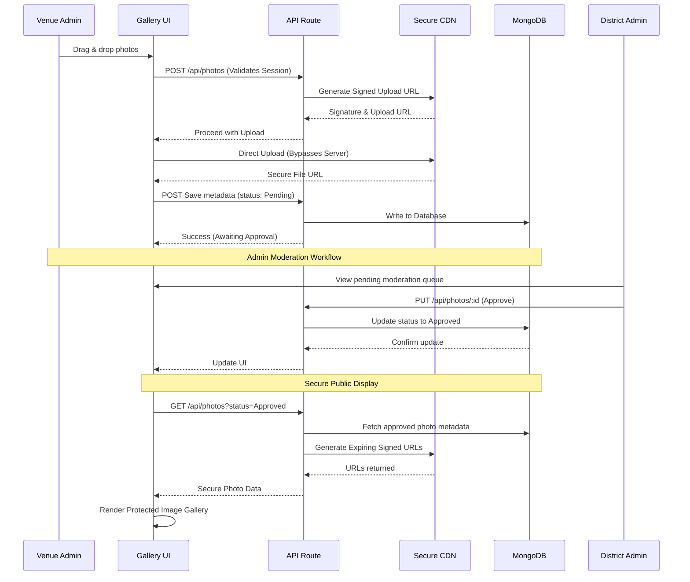
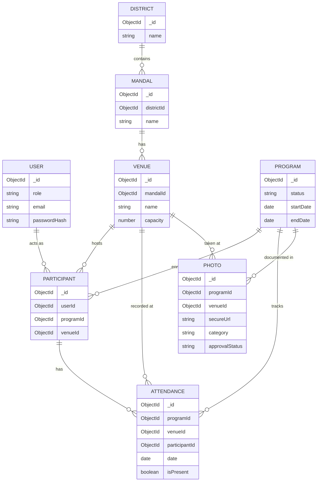

# Gnana Prakash Training Management & Monitoring System (TMS)
## Comprehensive Architecture & Technical Specification

> **CONFIDENTIALITY & INTELLECTUAL PROPERTY NOTICE**
> 
> **DO NOT COPY.** This document and the system it describes are the exclusive intellectual property of the Department of School Education, Government of Andhra Pradesh. Unauthorized copying, distribution, reproduction, or reverse-engineering of this architecture, codebase, or documentation is strictly prohibited and subject to legal action.
> 
> The application itself employs strict content protection measures, including right-click disabling, image watermarking, and secure session validation to prevent unauthorized data scraping and media downloading.

---

## 1. System Architecture In-Depth

The application follows a modern, full-stack Next.js (App Router) architecture, utilizing React 19 Server Components to push rendering to the edge and minimize client-side payloads. It separates concerns across different layers for maximum scalability and maintainability.

### 1.1 High-Level Architecture Diagram

```mermaid
graph TD
    Client[Client / Browser (React 19)]
    NextApp[Next.js App Router (Server Components)]
    
    subgraph Frontend Ecosystem
        UI[shadcn/ui & Tailwind CSS]
        State[TanStack Query v5]
        Forms[React Hook Form + Zod Validation]
        Protection[Anti-Copy & Content DRM]
    end
    
    subgraph Backend API Layer
        Routes[Next.js Route Handlers]
        Auth[NextAuth.js RBAC Engine]
        Middleware[Edge Middleware Security]
    end
    
    DB[(MongoDB Atlas - Encrypted at Rest)]
    CDN[Cloudinary / Secure Media Storage]

    Client <-->|HTTPS/REST| NextApp
    NextApp --> UI
    NextApp --> State
    NextApp --> Forms
    NextApp --> Protection
    
    State <-->|Secured API Calls| Routes
    Routes <--> Auth
    Routes <--> Middleware
    Routes <-->|Mongoose ORM| DB
    Routes <-->|Signed Uploads| CDN
```

### 1.2 Technology Stack Details
- **Frontend Framework**: Next.js 15 (React 19). Uses Server Components by default to reduce JavaScript bundle sizes, with Client Components used only where interactivity is required.
- **Language**: Strict TypeScript configuration for end-to-end type safety across the database, API, and frontend.
- **Styling**: Tailwind CSS combined with `shadcn/ui` for accessible, Radix-UI-backed reusable components. Custom themes for government branding.
- **Backend (API)**: Serverless Next.js Route Handlers (`src/app/api`).
- **Database**: MongoDB Atlas with Mongoose ORM. Queries are optimized using compound indexes.
- **Authentication & Authorization**: NextAuth.js (JWT strategy) combined with a robust Role-Based Access Control (RBAC) middleware that intercepts unauthorized requests at the Edge.
- **State Management & Data Fetching**: TanStack Query v5 (React Query) for optimistic UI updates, caching, and background data synchronization.
- **Form Handling**: React Hook Form combined with Zod for strict client and server-side schema validation.
- **Visualizations**: Recharts for interactive analytics and dynamic SVG rendering.

---

## 2. Comprehensive Feature Breakdown

### 2.1 Intellectual Property & Content Protection (Anti-Copy)
To prevent unauthorized distribution of training materials and participant data:
- **UI Protection**: Implementation of anti-copy scripts preventing right-clicking (`contextmenu` prevention), text selection, and keyboard shortcuts (Ctrl+C, Ctrl+S, F12).
- **Media DRM**: Images and videos in the gallery are served via secure, expiring URLs and utilize overlay watermarking to deter screenshots.
- **Data Obfuscation**: Sensitive reports are generated securely on the server-side, preventing client-side data scraping.

### 2.2 Role-Based Portals (RBAC) & Middleware
The system supports multiple distinct roles, each with tailored views, guarded by Next.js Edge Middleware:
- **Super Admin**: Full system access, user management, global analytics, and configuration of dynamic fields.
- **State Admin**: Read-only global analytics, high-level dashboards, and comprehensive report generation.
- **District Admin**: Scoped strictly to manage programs, venues, and media within their assigned district.
- **Mandal / Venue Admin**: Manages venue-specific day-to-day operations, including live attendance tracking and food distribution logging.
- **Teacher / Trainer**: Mobile-responsive portals for viewing assigned programs, daily schedules, and downloading authorized resources.

### 2.3 Training Program Lifecycle Management
- **Status Workflow**: Track programs through distinct phases: `Draft` (planning) → `Active` (ongoing) → `Completed` (archived).
- **Multi-District & Venue Coordination**: Assign a single state-wide program across multiple districts and hundreds of venues simultaneously using a unified interface.
- **Dynamic Extensibility**: Support for custom metadata fields and tags, allowing administrators to categorize and extend program data models dynamically without requiring developer intervention or code changes.

### 2.4 Venue & Participant Management
- **Venue Directory & Auditing**: Track venue capacities, physical facilities (projectors, internet, seating), and administrative contact information.
- **Participant Allocation Engine**: Batch assign teachers and trainers to specific programs and physical venues, preventing scheduling conflicts.

### 2.5 Attendance & Food Tracking Engine
- **Granular Daily Attendance**: Track day-wise attendance across various participant categories (e.g., Subject Teachers, Principals, Complex Resource Persons).
- **Automated Calculations**: Real-time aggregation of attendance metrics.
- **Cryptographic Validation**: Capture Assistant Mandal Officer (AMO) digital signature images alongside cryptographic timestamps as indisputable proof of attendance.
- **Food Management Logistics**: Track daily food consumption (breakfast, lunch, snacks) dynamically validated against the expected and actual attendance to prevent resource wastage.

### 2.6 Advanced Media Management & Interactive Image Gallery
The platform includes an enterprise-grade media management system to visually document training progress while maintaining strict quality control.

- **Resilient Uploads**: Chunked, drag-and-drop file upload capabilities. Photos support up to 10MB per file, and videos support up to 500MB with resumable uploads.
- **Intelligent Categorization**: Uploads are forced into predefined taxonomic categories (e.g., Inauguration, Classroom Session, Food Distribution, Valedictory) and strictly linked to specific venues and program IDs.
- **Multi-Tier Approval Workflow**: Uploaded media defaults to a `Pending` state. District or State Admins review media in a moderation queue and mark them as `Approved` or `Rejected`.
- **Protected Interactive Gallery**: 
  - A highly responsive, masonry-style gallery layout for viewing approved photos.
  - Secure lightbox capabilities for full-screen viewing (with anti-download measures).
  - Advanced filtering by category, date range, district, and specific training program.



### 2.7 Real-time Analytics & Reporting
- **Interactive Dashboards**: Live district-wise participation charts, attendance attrition trends, and venue utilization metrics rendered natively using Recharts.
- **Exportable Compliance Reports**: Generate exhaustive compliance reports for attendance, venues, and food utilization. Exportable in strictly formatted PDF, Excel, and JSON formats for external auditing.

---

## 3. Database Schema Overview

The MongoDB database utilizes Mongoose references to create a highly relational document structure, ensuring data integrity while maintaining document database speed.

### 3.1 Entity-Relationship (ER) Diagram



---

## 4. Security, Auditing & Compliance

Designed strictly to adhere to Government of Andhra Pradesh data and security standards:
- **Data Privacy & Residency**: Zero external analytics tracking (No Google Analytics/Meta Pixels). Data residency strictly maintained within India (MongoDB Atlas Mumbai Region).
- **Secure Authentication**: Passwords hashed using `bcrypt` (salt rounds 12). Sessions managed via short-lived, HTTP-only JWT cookies to prevent XSS attacks.
- **Edge Route Protection**: Next.js Middleware intercepts all requests to `/dashboard` and `/api` to validate JWTs at the edge, preventing unauthorized access before the request hits the main server.
- **Immutable Auditability**: All critical `Create`, `Update`, and `Delete` actions trigger immutable events in the `AuditLogs` collection, recording the User ID, Timestamp, IP Address, and the exact payload changed for strict forensic accountability.
- **Rate Limiting**: API routes are rate-limited to prevent DDoS and brute-force attacks on sensitive endpoints.

